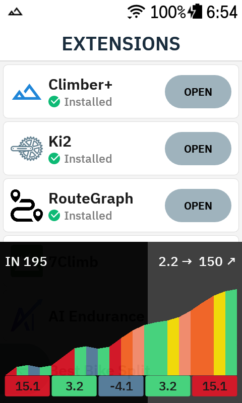
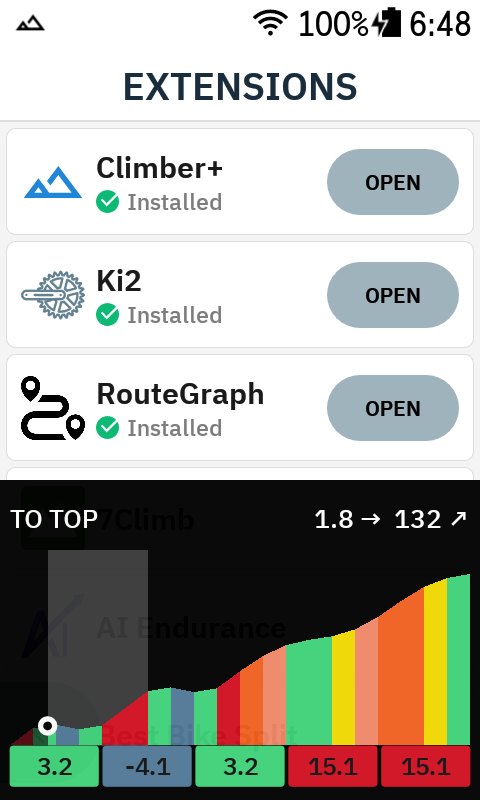
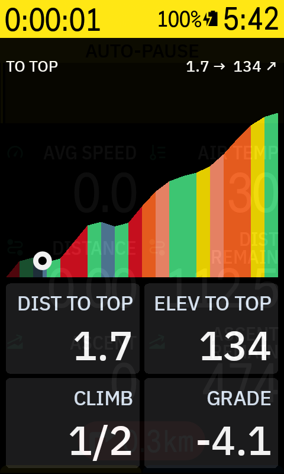

# Climber+

[](LICENSE)


A free, open-source climb overlay for [Hammerhead Karoo](https://www.hammerhead.io)
cycling computers. Like the built-in Karoo OS Climber — but more flexible: a
floating overlay that lives on top of any ride page, with configurable palettes,
display modes, preview windows and data fields.

Built on the official [karoo-ext](https://github.com/hammerheadnav/karoo-ext)
extension API. No system modification.

| Drawer (approaching) | Drawer (climbing) | Full screen |
|---|---|---|
|  |  |  |

## Features

- **Permanent chip** while a route is loaded:
  - `2/5 climbs` — completed / total on route
  - `in 400 m` — countdown to the next climb
  - `8% · 1.4 km` — live grade and distance to top while climbing
- **Climb drawer** pops up automatically before each climb (configurable trigger
  distance, default 500 m):
  - elevation profile of the climb, colored by grade in 100 m chunks
  - approach progress bar: the background fills as you close in on the start
  - distance to top and elevation to top
  - **next-500 m strip**: five 100 m tiles with the exact grades ahead of you,
    with the matching section highlighted on the profile
- **Full-screen view** (swipe up): profile + four **configurable data fields** —
  climb metrics (dist/elev to top, climb x/y, current/avg grade, length) or live
  system data (speed, power, 3s power, HR, cadence, ascent, distance)
- **Climbs list**: the next 3 climbs in the drawer, the full scrollable list in
  full screen — to start / length / avg grade, rows colored by grade
- **Display modes**, cycled by tapping the profile:
  - full climb (completed part shaded)
  - remaining part only
  - preview windows: next 2 / 5 / 10 km (customizable list; windows longer than
    the remaining climb are skipped, auto-reverts when you pass them)
- **6 grade palettes**: Karoo, Wahoo, Garmin, Zwift, HSLuv, Turbo
  (adapted from [Barberfish](https://github.com/jpweytjens/barberfish))
- Metric and imperial units (follows your Karoo rider profile)
- Overlay position (top/bottom), height and opacity settings
- **Demo mode**: preview everything on the couch, no route or ride needed

### Gestures

| Gesture | Action |
|---|---|
| Tap chip | open the drawer |
| Tap drawer/full profile | cycle display modes |
| Swipe up | drawer → full screen |
| Swipe down | full screen → drawer → chip |
| Drag (full-screen list) | scroll climbs |

## Installation

Climber+ works on Karoo 2 and Karoo 3 (Karoo OS with Extensions support).

1. Download the latest `app-debug.apk` from the releases page (or build it, see
   below).
2. Enable Developer Options + USB debugging on the Karoo
   ([Hammerhead guide](https://support.hammerhead.io/hc/en-us/articles/30696553134363)).
3. Install:
   ```sh
   adb install app-debug.apk
   ```
4. Open **Climber+** from the Karoo launcher and grant the
   **draw over other apps** permission (required for the overlay window).
5. Optional: flip on **Demo mode** in the settings to see the overlay in action
   immediately.

On a ride: load a route with detected climbs and start navigating — the chip
appears right away, the drawer pops before each climb.

## Configuration

Open the Climber+ app on the Karoo:

- **Overlay**: enable/disable, permission status
- **Gradient palette**: 6 palettes with preview strips
- **Base display mode**: full climb / remaining only / both (in the tap cycle)
- **Show before climb**: 100–2000 m trigger distance
- **Tap preview windows**: add/remove custom km windows
- **Position / Height / Opacity**: where and how big the drawer is
- **Full-screen view fields**: pick the four data fields
- **Debug**: demo mode with a canned two-climb route

## Building

Requires JDK 17 and the Android SDK (platform 34). `karoo-ext` resolves via
JitPack — no GitHub credentials needed.

```sh
./gradlew assembleDebug        # apk: app/build/outputs/apk/debug/app-debug.apk
./gradlew testDebugUnitTest    # unit tests (climb math, modes, polyline codec)
```

## How it works

- Route, climbs and the elevation profile come from karoo-ext
  `OnNavigationState` — the same climb data Karoo's own Climber uses.
- Rider progress is derived from the `DISTANCE_TO_DESTINATION` stream.
- The overlay is a standard Android `TYPE_APPLICATION_OVERLAY` window (the
  same approach as [Ki2](https://github.com/valterc/ki2)) hosted by the
  extension's foreground service.
- Rendering is a plain `Canvas` view with per-climb caching — cheap enough for
  the Karoo 2.

### Limitations

- Progress is derived from distance-to-destination; while off-route it can be
  slightly off until you rejoin.
- If Karoo OS doesn't provide an elevation polyline for a route, the profile
  falls back to a constant-grade rendering from the climb summary.
- System data fields show `--` until their stream produces values (in-ride).

## Credits

- [karoo-ext](https://github.com/hammerheadnav/karoo-ext) by Hammerhead
  (Apache-2.0)
- Grade palettes adapted from
  [Barberfish](https://github.com/jpweytjens/barberfish) (Apache-2.0)
- Overlay window pattern inspired by [Ki2](https://github.com/valterc/ki2)
  by valterc
- More Karoo extensions: [awesome-karoo](https://github.com/timklge/awesome-karoo)

## Disclaimer

This app is not affiliated with, endorsed by, or supported by Hammerhead or
SRAM. Use at your own risk; keep your eyes on the road.

## License

[Apache License 2.0](LICENSE) — Copyright 2026 hazzus
