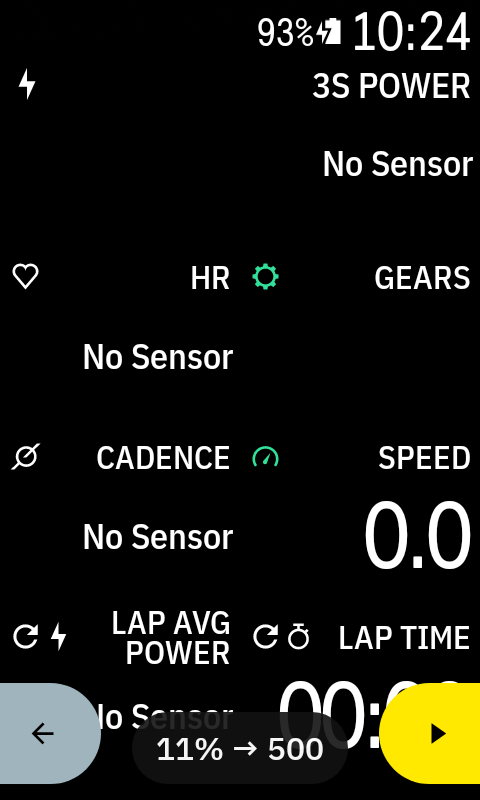
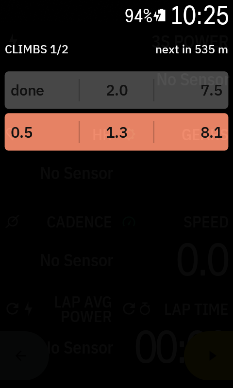

# Climber+

[](LICENSE)


A free, open-source climb overlay for [Hammerhead Karoo](https://www.hammerhead.io)
cycling computers. Like the built-in Karoo OS Climber — but more flexible: a
floating overlay that lives on top of any ride page, with configurable palettes,
display modes, preview windows and data fields.

Built on the official [karoo-ext](https://github.com/hammerheadnav/karoo-ext)
extension API. No system modification.

| Chip (climbing) | Drawer (approaching) | Drawer (climbing) | Climbs list | Full screen |
|---|---|---|---|---|
|  |  |  |  |  |

## What's different from the native Climber

Climber+ mirrors the native look — Hammerhead's own icon glyphs and the
Karoo's IBM Plex Sans Condensed font — but goes further where it counts:

- **Display modes.** Tap the profile to cycle views: the full climb with the
  completed part shaded, the remaining part only, or zoomed preview windows
  (next 2 / 5 / 10 km, configurable). The native Climber has a single fixed
  view.
- **Smooth next-100 m tiles.** The five grade tiles ahead are recalculated
  from your exact position on every update, so they slide with you
  continuously. Native chunks are snapped to a fixed 100 m grid, so values
  jump at each chunk border.
- **Floating overlay.** Lives on top of any ride page (position, height and
  opacity are configurable) instead of being its own page.
- Plus: 6 grade palettes, configurable data fields, configurable trigger
  distance, a climbs list, and a demo mode.

## Features

- **Permanent chip** while a route is loaded:
  - `2/5 climbs` — completed / total on route
  - `IN 400` — countdown to the next climb
  - `8% ⇢ 1.4` — live grade and distance to top while climbing (with the
    Hammerhead route-to glyph in between)
- **Climb drawer** pops up automatically before each climb (configurable trigger
  distance, default 500 m):
  - elevation profile of the climb, colored by grade in 100 m chunks
  - approach progress bar: the background fills as you close in on the start
  - distance to top and elevation to top, marked with the native Hammerhead
    glyphs instead of unit labels
  - **next-500 m strip**: five 100 m tiles with the exact grades ahead of you,
    with the matching section highlighted on the profile — sliding smoothly
    from your position, not snapped to a fixed grid
- **Full-screen view** (swipe up): profile + four **configurable data fields** —
  the overlay's own climb metrics, plus *anything the Karoo provides*: every
  karoo-ext data stream (power, heart rate, VAM, laps, live segments, e-bike,
  and so on) selectable from a categorized picker. With
  [Ki2](https://github.com/valterc/ki2) installed, Shimano Di2 fields are
  available too (gears, gear ratio, shift counts, Di2 battery)
- **Climbs list**: the next 3 climbs in the drawer, the full scrollable list in
  full screen — to start / length / avg grade, rows colored by grade, finished
  climbs ticked off with a checkmark
- **Display modes**, cycled by tapping the profile:
  - full climb (completed part shaded)
  - remaining part only
  - preview windows: next 2 / 5 / 10 km (customizable list; windows longer than
    the remaining climb are skipped, auto-reverts when you pass them)
- **6 grade palettes**: Karoo, Wahoo, Garmin, Zwift, HSLuv, Turbo
  (adapted from [Barberfish](https://github.com/jpweytjens/barberfish))
- Metric and imperial units (follows your Karoo rider profile)
- Overlay position (top/bottom), height and opacity settings
- **Demo mode**: preview everything on the couch, no route or ride needed

### Gestures

Swipe directions follow the overlay position: swiping away from the anchored
edge grows the panel, swiping toward it shrinks.

| Action | Gesture (top) | Gesture (bottom) |
|---|---|---|
| Open the drawer | tap chip | tap chip |
| Cycle display modes | tap drawer/full profile | tap drawer/full profile |
| Grow: drawer → full screen | swipe down | swipe up |
| Shrink: full screen → drawer → chip | swipe up | swipe down |
| Scroll climbs (full-screen list) | drag | drag |

## Installation

Climber+ works on Karoo 2 and Karoo 3 (Karoo OS with Extensions support).

**Via the Hammerhead companion app** (Karoo 3, recommended): open
[the latest APK link](../../releases/latest/download/karoo-climber-plus.apk)
on your phone and share it with the Hammerhead Companion app to sideload it.
Once installed, the Karoo picks up new releases automatically (the app
publishes a karoo-ext `manifest.json` with each release).

**Via adb:**

1. Download the latest `karoo-climber-plus.apk` from the
   [releases page](../../releases) (or build it, see below).
2. Enable Developer Options + USB debugging on the Karoo
   ([Hammerhead guide](https://support.hammerhead.io/hc/en-us/articles/30696553134363)).
3. Install:
   ```sh
   adb install karoo-climber-plus.apk
   ```

Then open **Climber+** from the Karoo launcher and grant the
**draw over other apps** permission (required for the overlay window).
Optional: flip on **Demo mode** in the settings to see the overlay in action
immediately.

On a ride: load a route with detected climbs and start navigating — the chip
appears right away, the drawer pops before each climb.

## Configuration

Open the Climber+ app on the Karoo:

- **Overlay**: enable/disable, permission status
- **Gradient palette**: 6 palettes with preview strips
- **Base display mode**: full climb / remaining only / both (in the tap cycle)
- **Show before climb**: 100–2000 m trigger distance
- **Tap preview windows**: add/remove custom km windows
- **Position / Height / Opacity**: where and how big the drawer is
- **Full-screen view fields**: pick the four data fields from a categorized
  menu — climb metrics, any Karoo data stream, and Ki2 (Di2) fields
- **Debug**: demo mode with a canned two-climb route

## Building

Requires JDK 17 and the Android SDK (platform 34). `karoo-ext` resolves via
JitPack — no GitHub credentials needed.

```sh
./gradlew assembleDebug        # app/build/outputs/apk/debug/karoo-climber-plus-debug.apk
./gradlew testDebugUnitTest    # unit tests (climb math, modes, polyline codec)
```

Release builds are signed with a local keystore: copy `keystore.properties`
(see `app/build.gradle.kts`; not committed) pointing at your own keystore,
then `./gradlew assembleRelease` produces
`app/build/outputs/apk/release/karoo-climber-plus.apk`.

### Releasing

Releases are cut by CI (`.github/workflows/release.yml`): bump `versionCode`
and `versionName` in `app/build.gradle.kts`, then tag and push:

```sh
git tag v0.2.0 && git push origin v0.2.0
```

The workflow runs the unit tests, builds the signed APK and publishes a GitHub
release with `karoo-climber-plus.apk` and the karoo-ext `manifest.json`
attached (installed devices see the update automatically). Signing uses the
repo secrets `KEYSTORE_BASE64` (`base64 -i` of the `.jks`),
`KEYSTORE_PASSWORD`, `KEY_ALIAS` and `KEY_PASSWORD`.

## How it works

- Route, climbs and the elevation profile come from karoo-ext
  `OnNavigationState` — the same climb data Karoo's own Climber uses.
- Rider progress is derived from the `DISTANCE_TO_DESTINATION` stream.
- The overlay is a standard Android `TYPE_APPLICATION_OVERLAY` window (the
  same approach as [Ki2](https://github.com/valterc/ki2)) hosted by the
  extension's foreground service.
- Rendering is a plain `Canvas` view with per-climb caching — cheap enough for
  the Karoo 2.

### Limitations

- Progress is derived from distance-to-destination; while off-route it can be
  slightly off until you rejoin.
- If Karoo OS doesn't provide an elevation polyline for a route, the profile
  falls back to a constant-grade rendering from the climb summary.
- System data fields show `--` until their stream produces values (in-ride).
- Ki2 (Di2) fields need the [Ki2](https://github.com/valterc/ki2) extension
  installed and the shifters paired/awake.

## Credits

- [karoo-ext](https://github.com/hammerheadnav/karoo-ext) by Hammerhead
  (Apache-2.0)
- Grade palettes adapted from
  [Barberfish](https://github.com/jpweytjens/barberfish) (Apache-2.0)
- Overlay window pattern inspired by [Ki2](https://github.com/valterc/ki2)
  by valterc
- More Karoo extensions: [awesome-karoo](https://github.com/timklge/awesome-karoo)

## Disclaimer

This app is not affiliated with, endorsed by, or supported by Hammerhead or
SRAM. Use at your own risk; keep your eyes on the road.

## License

[Apache License 2.0](LICENSE) — Copyright 2026 hazzus
